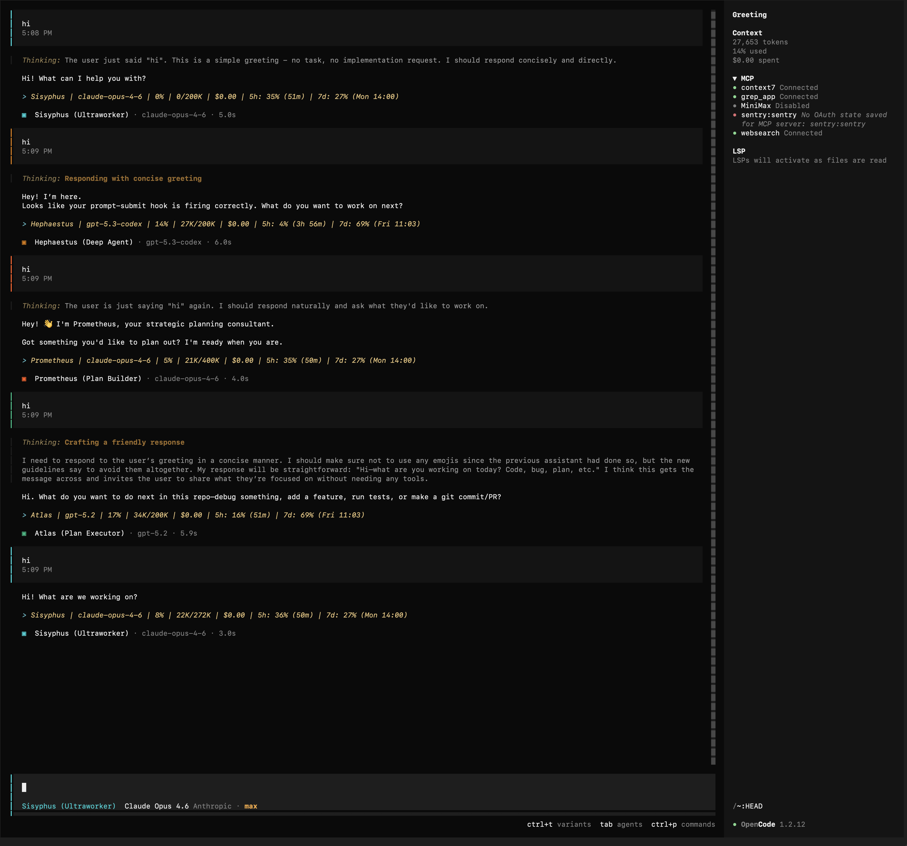

# opencode-status-hud

> Real-time usage HUD for [OpenCode](https://github.com/anomalyco/opencode) CLI

[](https://www.npmjs.com/package/opencode-status-hud)
[](https://github.com/Two-Weeks-Team/opencode-status-hud/actions/workflows/ci.yml)
[](https://opensource.org/licenses/MIT)

Every assistant response shows your live usage at a glance:

<p align="center">
  
</p>

```text
> Sisyphus | claude-opus-4-6 | 42% | 85K/200K | $12.30 | 5h: 10% (3h 55m) | 7d: 24% (Mon 14:00)
```

```
  Agent      Model            Ctx%   Tokens     Cost    5h window           7d window
```

## Install

```bash
npm install -g opencode-status-hud
opencode-status-hud install
```

Then start OpenCode normally. The HUD is active automatically.

```bash
opencode
```

## Features

- **Live API utilization** — Real percentage from Anthropic and OpenAI Codex dashboards (5h and 7d windows with reset countdown)
- **Context tracking** — Token usage and context window percentage per message
- **Session cost** — Running dollar cost for the current session
- **Agent-aware** — Shows active agent name with color-coded theming
- **Multi-provider** — Anthropic Claude and OpenAI Codex, auto-detected from existing credentials
- **Zero config** — No environment variables required; credentials resolved from your existing provider setup
- **Dim display** — Renders as a blockquote so it stays visually unobtrusive

## HUD Format

| Segment | Example | Description |
|---------|---------|-------------|
| Agent | `Sisyphus` | Active agent name (color-coded) |
| Model | `claude-opus-4-6` | Current model identifier |
| Context % | `42%` | Context window utilization |
| Tokens | `85K/200K` | Used / limit |
| Cost | `$12.30` | Session cost |
| 5h window | `5h: 10% (3h 55m)` | Provider rate limit — real % if API available, ~approx otherwise |
| 7d window | `7d: 24% (Mon 14:00)` | Weekly rate limit with reset time |

When the provider API is unreachable, windows fall back to `~` approximate values calculated from local token history.

## How It Works

The plugin hooks into OpenCode's plugin system:

1. **`event`** — Tracks `message.updated` events to collect token usage per assistant message
2. **`chat.params`** — Captures model metadata and agent identity
3. **`experimental.text.complete`** — Appends the HUD line as a blockquote to assistant output
4. **`tool.execute.before/after`** — Feeds the state machine for tool transition tracking

Provider API data (Anthropic usage headers, OpenAI Codex billing) is polled in the background and cached to disk for instant display on restart.

## Configuration

Defaults work out of the box. Override with environment variables only if needed:

| Variable | Values | Default |
|----------|--------|---------|
| `OPENCODE_STATUS_HUD_USAGE_DISPLAY` | `output`, `prompt`, `output+prompt` | `output` |
| `OPENCODE_STATUS_HUD_VERBOSITY` | `low`, `normal`, `high` | `normal` |
| `OPENCODE_STATUS_HUD_PROMPT_PROFILE` | `minimal`, `balanced`, `verbose` | `minimal` |
| `OPENCODE_STATUS_HUD_USAGE_PROMPT_INTERVAL_MS` | `0` (disable) or `>=1000` | `10000` |

## Uninstall

```bash
opencode-status-hud uninstall
npm uninstall -g opencode-status-hud
```

## For LLM Agents

Give your coding agent this instruction:

```text
Install and configure opencode-status-hud by following:
https://raw.githubusercontent.com/Two-Weeks-Team/opencode-status-hud/refs/heads/master/docs/guide/installation.md
```

## Requirements

- Node.js >= 22
- [OpenCode CLI](https://github.com/anomalyco/opencode)

## License

MIT
